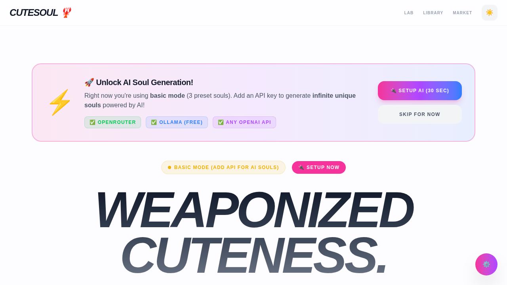

# CuteSoul 🌸

> **"Weaponized Cuteness" for your AI Agents.**



**CuteSoul** is a visual personality engine designed to generate, fine-tune, and export "Soul Manifests" (`SOUL.md` files) for AI agents. It replaces dry text prompts with a vibrant, playful UI that lets you design the *vibe* of your agent.

## ✨ Features

- **🎨 Mood Generator**: Choose from preset archetypes like *Bubblegum Dream*, *Midnight Thinker*, and *Spark Plug*.
- **🎛️ Trait Tuner**: Fine-tune personality sliders (Warmth, Energy, Wit, Depth) to get the perfect voice.
- **📄 Live Manifest Preview**: Real-time generation of `SOUL.md` files compatible with OpenClaw and other agent frameworks.
- **💎 Premium Aesthetic**: Glassmorphism, soft gradients, and fluid animations.

## 🛠️ Tech Stack

- **Runtime**: [Bun](https://bun.sh) (Fast & all-in-one)
- **Framework**: Next.js 14 (App Router)
- **Styling**: Tailwind CSS + Framer Motion (planned)
- **Icons**: Lucide React

## 🚀 Getting Started

### Prerequisites

- [Bun](https://bun.sh) installed (`curl -fsSL https://bun.sh/install | bash`)

### Installation

```bash
# Clone the repo
git clone https://github.com/CrimsonDevil333333/cute_soul.git
cd cute_soul

# Install dependencies
bun install
```

### Development

```bash
bun dev
```
Open [http://localhost:3000](http://localhost:3000) to see the magic.

## 🎨 Design System

See [DESIGN.md](./DESIGN.md) for the full breakdown of our "Weaponized Cuteness" design language, color palettes, and component architecture.

---

*Built with 💖 by the MoltCorp Design Team (Iris & Clawdy)*
